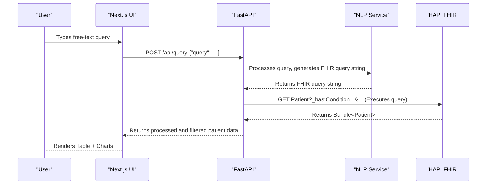

# Healthcare Query Tool 🩺

Transform plain-English clinical questions into precise FHIR R4 REST calls and beautiful, interactive patient dashboards.

---

## ✨ Features

• Natural-language → FHIR translation powered by **spaCy (en_core_web_md)**  
• Two-step "Condition ➜ Patient" query strategy to drastically shrink result sets  
• Connects out-of-the-box to the public **HAPI FHIR R4 test server** (`https://hapi.fhir.org/baseR4`)  
• Modern **Next.js 14** front-end with TailwindCSS & TypeScript  
• Data table with smart filters, pagination & CSV export  
• Recharts dashboards (age, gender, geography) generated on the fly  
• Fully typed back-end (Pydantic models) & end-to-end eslint / prettier tooling

---

## ⚡ Quick Start

```bash
# 1. Backend
cd backend
python -m venv venv && source venv/bin/activate
pip install -r requirements.txt
python -m spacy download en_core_web_md
cd app
uvicorn main:app --host 0.0.0.0 --port 8000  # → http://localhost:8000

# 2. Frontend
cd ../frontend
npm install
npm run dev                    # → http://localhost:3000
```

---

## 🏗️ Architecture Overview



### Data Flow (text)
1. **User** enters a clinical question in plain English.
2. **Next.js** calls the `/api/query` endpoint on the FastAPI back-end.
3. The **NLP Service** (spaCy + custom rules) extracts criteria (conditions, demographics) and builds a single, powerful FHIR Patient query.
4. The **FastAPI** backend executes this query against the **HAPI FHIR** server, fetching up to 5000 records.
5. The backend then **filters and samples** this data based on business rules (e.g., valid age ranges) to create a clean, relevant dataset.
6. This final data payload is returned to the **Next.js UI**, which then renders the interactive patient table and charts.

---

## 📂 Current Project Structure

```
healthcare-query-tool/
├── backend/
│   ├── app/
│   │   ├── main.py               # FastAPI application
│   │   └── nlp-service/
│   │       ├── medical_entities.py
│   │       ├── query_parser.py
│   │       ├── fhir_builder.py
│   │       └── nlp_service.py
│   ├── requirements.txt
│   └── test_api.py
├── frontend/
│   ├── src/
│   │   ├── app/
│   │   │   ├── page.tsx          # Landing page & query workflow
│   │   │   ├── layout.tsx        # Global layout & Tailwind styles
│   │   │   └── api/query/route.ts# Next.js API route → /api/query
│   │   └── components/
│   │       ├── SearchBox.tsx
│   │       ├── PatientTable.tsx
│   │       ├── PatientCharts.tsx
│   │       ├── QuerySuggestions.tsx
│   │       └── Header.tsx
│   ├── next.config.ts
│   └── package.json
└── README.md
```

---

## 🔍 What I Focus On

1. **A complete end-to-end prototype** – from NLP to live FHIR data & UI visualisation.
2. **Instant feedback** – every generated REST call is displayed so clinicians can trust the translation layer.
3. **Usability** – simple query suggestions, loading states, filters and charts to make the data explorable.
4. **Clean, modular code** – separate concerns (extraction, parsing, query building) for easy future swaps.

---

## ✅ Current Check-List

* [x] Containerize the backend using Docker
* [x] Deploy the image on Cloud Run
* [ ] Migrate: NLP --> LLM Call for Query conversion
* [ ] Make Condition --> SnomedCT/ICD10 Code mapping robust (use a library) 
* [ ] Populate HAPI FHIR server with relevant mock data
* [ ] Implement search auto-complete for Queries
* [ ] Add export as CSV/XLS feature to Patient data table

---

## 🚀 Future Works

• **Transformer-based NLP** – fine-tune a Clinical BERT / BioGPT model on synthetic EHR utterances for higher recall on medical entities.  
• **SMART on FHIR + OAuth 2.0** – enable login against real EHR sandboxes.  
• **Caching & batching** – reduce round-trips to the FHIR server, especially for large Condition queries.  
• **Export & integrations** – CSV / HL7 export, embed charts, embed in EMR side-panel.  
• **Accessibility polish** – WCAG compliant colour palettes & keyboard-only navigation.

---

## 🛡️ Security & Compliance (HIPAA 1-Pager)

| Area | Strategy |
|------|----------|
| **Authentication & Authorization** | • Adopt **SMART on FHIR** profile: OAuth 2.0 / OpenID Connect with short-lived access tokens.<br/>• Leverage **PKCE** for public clients.<br/>• Issue **refresh tokens** only to confidential clients running on the backend. |
| **RBAC** | • Define granular SMART scopes (e.g. `patient/Condition.read`).<br/>• Map users to roles (Clinician, Researcher, Admin) in an IAM service (Okta/Auth0/Keycloak). |
| **Data Privacy** | • All traffic over **TLS 1.3** (`https`).<br/>• No PHI stored at rest by default; if persistence is needed, encrypt with AES-256 & managed keys (KMS).<br/>• Tokenise or hash direct identifiers before logging/analytics. |
| **Audit Logging** | • Immutable, append-only logs (Cloud Trail / Loki / ELK) capturing user, timestamp, IP, FHIR resource and action.<br/>• Regular review & alerting on unusual access patterns. |
| **Infrastructure** | • Containerise services, run in **Kubernetes** with **network policies** isolating NLP pod from DB.<br/>• Use **Secrets Manager** for credentials.<br/>• Automated CIS benchmark scans + SCA/DAST in CI. |

These controls collectively satisfy the **HIPAA Security Rule**'s safeguards (Technical, Physical, Administrative) and ensure secure handling of FHIR resources throughout the stack.

---

## 🤝 Contributing

1. Fork → feature branch → PR.  
2. Run `python test_api.py` (backend) & `npm run lint` (frontend) before submitting.  
3. Describe the clinical use-case your change enables.

---

## 📜 License

For educational & research use only – *no warranty for clinical deployment.* 
